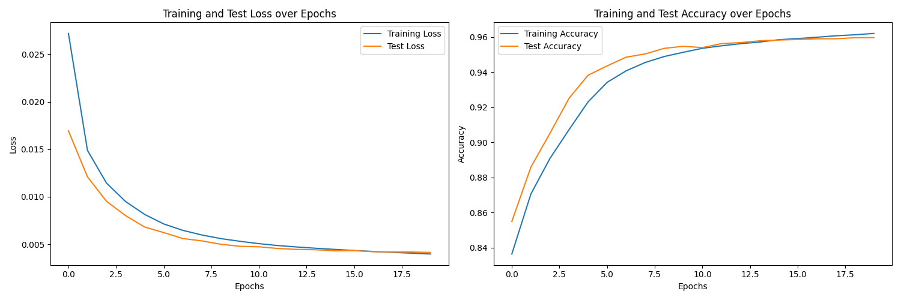

# Named Entity Recognition (NER) with LSTM and BERT

This repository presents a comparative study of two deep learning architectures – Long Short-Term Memory (LSTM) networks and Bidirectional Encoder Representations from Transformers (BERT) – for Named Entity Recognition (NER). The project aims to identify and classify named entities in text data, demonstrating the performance characteristics of each model.

## Table of Contents

- [Introduction](#introduction)
- [Project Structure](#project-structure)
- [Models Implemented](#models-implemented)
  - [LSTM Model](#lstm-model)
  - [BERT Model](#bert-model)
- [Results](#results)
  - [Training Performance](#training-performance)
  - [Model Performance (Confusion Matrices)](#model-performance-confusion-matrices)


## Introduction

Named Entity Recognition (NER) is a crucial task in Natural Language Processing (NLP) that involves locating and classifying named entities in unstructured text into pre-defined categories such as person names, organizations, locations, medical codes, time expressions, quantities, monetary values, percentages, etc. This project explores the effectiveness of two prominent neural network architectures, LSTM and BERT, for achieving high accuracy in NER tasks.

## Project Structure

```shall
📂 sarcasm-detection/
├── 📁 data/                  # Download Dataset files
├── 🤖 best_model_bert/       # Model checkpoint for BERT (not uploaded)
├── 🧠 best_model_lstm/       # Model checkpoint for LSTM
├── 💻 src/                   # Source code
├── 📊 runs/                  # For logging by tensorboard
├── 🖼️ images/                # For models plots and confusion matrix
├── 📓 notebooks/             # Jupyter notebooks for experimentation and analysis
├── ⚙️ config/                # Configuration
├── 📜 requirements.txt       # Dependencies
└── 📖 README.md              # This file
```

## Models Implemented

### LSTM Model

The Long Short-Term Memory (LSTM) network is a type of recurrent neural network (RNN) capable of learning long-term dependencies. For NER, LSTMs are often used in a sequence-to-sequence setup, processing words in a sentence and predicting the corresponding entity tag for each word.

### BERT Model

Bidirectional Encoder Representations from Transformers (BERT) is a pre-trained transformer-based model developed by Google. BERT is known for its ability to capture rich contextual information from text by processing words bidirectionally. For NER, BERT's pre-trained embeddings and fine-tuning capabilities make it a powerful choice.

## Results

This section presents the key performance metrics and visualizations from the training and evaluation of both the LSTM and BERT models.

### Training Performance

The plots below illustrate the training and test loss, as well as training and test accuracy, over epochs for both models.

#### LSTM Training Performance

The LSTM model shows a steady decrease in both training and test loss, indicating good convergence. The accuracy for both training and test sets increases consistently, with the test accuracy closely following the training accuracy, suggesting that the model is generalizing well and not overfitting significantly.



#### BERT Training Performance

The BERT model also demonstrates a clear trend of decreasing loss and increasing accuracy over epochs. Similar to the LSTM, the test loss decreases and test accuracy increases in tandem with their training counterparts, indicating effective learning and generalization.


### Model Performance (Confusion Matrices)

Confusion matrices provide a detailed breakdown of correct and incorrect classifications for each entity type. The rows represent the true labels, and the columns represent the predicted labels. The diagonal elements indicate correctly classified instances.

#### LSTM Confusion Matrix

The confusion matrix for the LSTM model reveals its classification performance across different entity categories. The darker shades on the diagonal indicate a higher number of correct predictions for those specific classes.


#### BERT Confusion Matrix

The BERT model's confusion matrix showcases its classification capabilities. A comparison with the LSTM matrix highlights the strengths and weaknesses of each model in distinguishing between various entity types.


